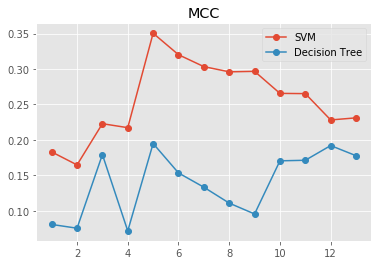
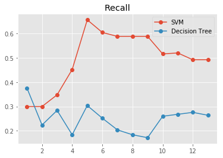
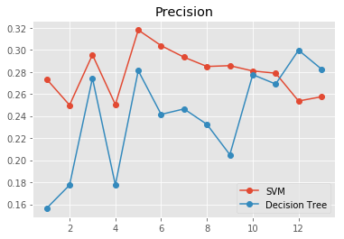
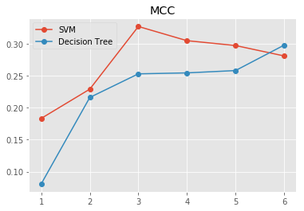
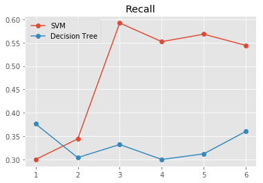
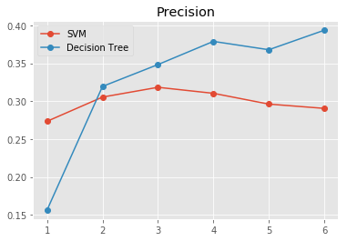

### **Summarize for us the goal of this project and how machine learning is useful in trying to accomplish it. As part of your answer, give some background on the dataset and how it can be used to answer the project question. Were there any outliers in the data when you got it, and how did you handle those?  [relevant rubric items: “data exploration”, “outlier investigation”]**

The famous ENRON scandal was the largest bankruptcy reorganization in the United States at the time it was publicized, October 2001. Due to the Federal investigation, a significant amount of confidential information was released to the public, including tens of thousands of emails and detailed financial data. The objective of this project is to use this large dataset to create a machine learning model that correctly identifiers the Persons of Interest (POI) based on the data made public.

At first glance, there were 2 problematic datapoins, TOTAL and THE TRAVEL AGENCY IN THE PARK. While TOTAL is self explanatory and safe to be removed, THE TRAVEL AGENCY IN THE PARK is actually a company (http://www.businesstravelnews.com/More-News/Enron-s-Agency-Changes-Name-Reaffirms-Corp-Commitment).

A closer look revealed that most of its features were missing and due to the fact it is not a person, much less a Person of Interest, this datapoint was removed too.

The last problematic datapoint was LOCKHART EUGENE E, all its features were missing, so it was removed too.

With the outliers and problematic datapoints removed, there were 143 persons left in the dataset, with 21 features each, including the POI flag. Of those only 18 were POI, so I knew I was dealing with heavily imbalanced classes.

### **What features did you end up using in your POI identifier, and what selection process did you use to pick them? Did you have to do any scaling? Why or why not? As part of the assignment, you should attempt to engineer your own feature that does not come ready-made in the dataset -- explain what feature you tried to make, and the rationale behind it. (You do not necessarily have to use it in the final analysis, only engineer and test it.) In your feature selection step, if you used an algorithm like a decision tree, please also give the feature importances of the features that you use, and if you used an automated feature selection function like SelectKBest, please report the feature scores and reasons for your choice of parameter values.  [relevant rubric items: “create new features”, “intelligently select features”, “properly scale features”]**

#### Feature creation and removal
I started by analyzing the email features and decided to create 2 new features based on ratios:
* 'from_poi_ratio' - ratio of messages from POI of all the received messages
* 'to_poi_ratio' - ratio of messages to POI of all the sent messages

They were created because there were people who sent a lot of emails and those that didn't, so reducing it to ratios makes sense for comparison. Both were selected to proceed with the statistical features selection, but only 'to_poi_ratio' was used in the creation of the model, 'from_poi_ratio' was deemed irrelevant.

Of the financial features 3 were removed due to excessive missing values and not enough POI (loan_advances, director_fees and restricted_stock_deferred):

                         Title: Count    Missing  POI Count  % Missing
                 loan_advances: 3        140      1          97.90   
                 director_fees: 16       127      0          88.81   
     restricted_stock_deferred: 17       126      0          88.11   
             deferral_payments: 38       105      5          73.43   
               deferred_income: 48       95       11         66.43   
           long_term_incentive: 65       78       12         54.55   
                         bonus: 81       62       16         43.36   
                         other: 91       52       18         36.36   
                        salary: 94       49       17         34.27   
                      expenses: 94       49       18         34.27   
       exercised_stock_options: 101      42       12         29.37   
              restricted_stock: 109      34       17         23.78   
                total_payments: 123      20       18         13.99   
             total_stock_value: 125      18       18         12.59   

#### Feature selection

To start the feature selection process, I used SelectKBest with the standard ANOVA function. Here's the resulting table:

                       p_value :           Feature            : F-score

        1.8182048777865317e-06 :   exercised_stock_options    : 24.815079733218194
        2.4043152760437106e-06 :      total_stock_value       : 24.182898678566872
          1.10129873239521e-05 :            bonus             : 20.792252047181538
        3.4782737683651706e-05 :            salary            : 18.289684043404513
         8.388953356704216e-05 :         to_poi_ratio         : 16.40971254803579
         0.0009220367084670714 :       deferred_income        : 11.458476579280697
          0.001994181245353672 :     long_term_incentive      : 9.922186013189839
          0.002862802957909168 :       restricted_stock       : 9.212810621977086
         0.0035893261725152385 :        total_payments        : 8.772777730091681
           0.01475819996537172 :           expenses           : 6.094173310638967
          0.042581747012345836 :            other             : 4.1874775069953785
           0.07911610566379423 :        from_poi_ratio        : 3.128091748156737
             0.636281647458697 :      deferral_payments       : 0.2246112747360051

SelectKBest provides a good way to choose the right features for a machine learning model. However, using just univariate statistics for feature selection doesn't take into account feature interaction, the ideal k is hard to pinpoint without further testing.

Ideally, testing every single feature combination would yield the best result, but it is both time and processing power expensive to do so.

The next best thing is to rank the features as it is done above, and recursively remove the lowest ranked one to test its value.

For the testing, two classifiers will be used, the simplest SVM: LinearSVC, and the base of the ensemble classifiers: DecisionTreeClassifier. Both will be run using stock parameter for now, with the exception of:

    class_weight='balanced' - highly beneficial for imbalanced datasets;
    and random_state=42 - for test–retest reliability.

The results, from k=1 (just the first feature, exercised_stock_options), all the way to k=13 (all these features):

In these plots, it becomes evident that the best value for k is 5, for both algorithms and the MCC and Recall metrics (more about the metrics below). However, there's a one interesting observations:

* The addition of features #2, #4, #6, #7, #8, #9 and (to a lesser extent) #11 appear to decrease the performance across the board (with few exceptions).

Removing these features by hand was extremely beneficial for the Decision Tree algorithm. The SVC suffered a bit, but not enough to not use the hand picked features for the rest of the project:

The selected features were:

* 'exercised_stock_options'
* 'bonus'
* 'to_poi_ratio'
* 'expenses'
* 'from_poi_ratio'
* 'deferral_payments'

#### Feature scaling

A few of the chosen models to test, namely SVMs, benefit from feature scaling as the features are of varying magnitudes.

The MinMaxScaler is a simple yet effective way to bring all the features to comparable values, between 0 and 1.

This increases the performance of SVM based algorithms, both in running speed and end results.

### **What algorithm did you end up using? What other one(s) did you try? How did model performance differ between algorithms?  [relevant rubric item: “pick an algorithm”]**

To choose an algorithm, I followed the Sklearn directives found here:  http://scikit-learn.org/stable/tutorial/machine_learning_map/index.html

Starting with the simplest all the way to ensemble classifiers:

    Linear SVC
    KN Classifier
    SVC (other kernels)
    Ensemble Classifiers
        - Random Forest
        - Adaboost

Both ensemble classifiers use Decision Trees as a base, so it makes sense to add it to the pre-selection too. Adaboost, in particular, sometimes benefits greatly from a tuned DecisionTreeClassifier as its base.

I did not test the performance of them beforehand, and used LinearSVC and DecisionTreeClassifier for feature selection.

The final algorithm selection and performance metrics are described on the answer of the last question in this document.

### **What does it mean to tune the parameters of an algorithm, and what can happen if you don’t do this well?  How did you tune the parameters of your particular algorithm? What parameters did you tune? (Some algorithms do not have parameters that you need to tune -- if this is the case for the one you picked, identify and briefly explain how you would have done it for the model that was not your final choice or a different model that does utilize parameter tuning, e.g. a decision tree classifier).  [relevant rubric items: “discuss parameter tuning”, “tune the algorithm”]**

Parameter tuning is where the art of machine learning resides. Picking an algorithm "off the shelves" rarely will result in optimal performance. The goal is to increase the algorithm performance by fine tuning how it makes its calculations.

Take a SVM Classifier, for example, tuning it's C and gamma values will change it's sensibility when learning from data. A lower C makes the decision surface smooth, while a higher value will make the algorithm fit more datapoints by creating new vectors. The gamma value defines how far a single datapoint influence reaches, from far (low values) to close (high values).

Fine tuning these parameters, with proper cross validation, helps to find the best possible bias-variance tradeoff.

A bad tuned model may end up being too biased, not having enough variability to predict a datapoint different from it's training dataset (overfitted), or with too much variance, not able to make useful predictions (underfitted). Therefore, It is crucial to correctly tune the algorithms.

Each algorithm has different parameters than in combination can dramatically change how it performs. Here's the list of the tuned parameters:

* Linear SVC
    + C
    + class_weight

* KN Classifier
    + n_neighbors
    + weights
    + algorithm
    + leaf_size
    + p

* SVC (other kernels)
    + kernel
    + C
    + gamma
    + class_weight

* Decision Tree
    + criterion
    + max_features
    + min_samples_leaf
    + class_weight

* Random Forest
    + n_estimators
    + criterion
    + max_features
    + min_samples_leaf
    + class_weight

* Adaboost
    + base_estimator
    + n_estimators
    + learning_rate
    + algorithm

The first step in fine tuning the models was choosing the right evaluation metric and cross validation strategy for this dataset.

#### Evaluation metrics

Due to the imbalanced nature of the dataset (way more non-POI than POI), using just accuracy, or even F1, results in poor detection performance. The objective here is fraud detection! A model that is accurate but doesn't detect a lot of POI is not a good one.

There is a metric specifically created to deal with highly imbalanced classes, called Matthews correlation coefficient:

The Matthews correlation coefficient is used in machine learning as a measure of the quality of binary (two-class) classifications. It takes into account true and false positives and negatives and is generally regarded as a balanced measure which can be used even if the classes are of very different sizes.[source: Wikipedia | http://scikit-learn.org/stable/modules/generated/sklearn.metrics.matthews_corrcoef.html | https://en.wikipedia.org/wiki/Matthews_correlation_coefficient]

The MCC is the chosen metric in this project for parameter tuning and evaluation.

### **What is validation, and what’s a classic mistake you can make if you do it wrong? How did you validate your analysis?  [relevant rubric items: “discuss validation”, “validation strategy”]**

Evaluating the performance of an algorithm without proper validation can result in overfitted models. This happens when the model performs great in during training, but does not have enough variability to predict new data. To avoid this, I implemented cross validation.

With the class imbalance present in the dataset, a stratified solution of cross-validation was needed. Scikit-learn provides us with 2:

    StratifiedKFold http://scikit-learn.org/stable/modules/generated/sklearn.model_selection.StratifiedKFold.html
    StratifiedShuffleSplit http://scikit-learn.org/stable/modules/generated/sklearn.model_selection.StratifiedShuffleSplit.html

Both will preserve the percentage of samples for each class. The key difference is the splitting method.

StratifiedKFold will split the dataset k times, and use k-1 folds for training and the remaining for testing. The process is repeated k times.

StratifiedShuffleSplit will shuffle the dataset and split it n_splits times respecting to the chosen test_size.

While both are valid ways of cross validation, due to the small size of the dataset,  I chose StratifiedShuffleSplit because it provides a lesser chance of overfitting.

### **Give at least 2 evaluation metrics and your average performance for each of them.  Explain an interpretation of your metrics that says something human-understandable about your algorithm’s performance. [relevant rubric item: “usage of evaluation metrics”]**

The metrics chosen to evaluate each model were:

* Matthews correlation coefficient: 

A coefficient of +1 represents a perfect prediction, 0 an average random prediction and -1 an inverse prediction.

* F1-score

The weighted average of the precision and recall.

* Precision

The ratio between true positives and all the positives predicted by the model. This can be interpreted as if the model accuses a person of being a POI, how sure is it.

* Recall

The recall is the ability of the classifier to find all the positive samples. Of all the POI what is the ratio found by the model.

* Accuracy

How accurate is the predictions, both positive and negative.

#### Performance

After exhaustively testing and parameter tuning, here are the models ranked, by the Matthews Correlation Coefficient:

               Classifier   MCC        F1    Precision   Recall   Accuracy 

             DecisionTree  0.4798    0.5365    0.4583    0.6880    0.8544  
                 AdaBoost  0.4698    0.5240    0.4536    0.6840    0.8502  
             RandomForest  0.4385    0.4997    0.4233    0.6480    0.8484  
                      SVC  0.3776    0.4163    0.2766    0.8680    0.7149  
                LinearSVC  0.3242    0.3897    0.3931    0.4600    0.8349  
               KNeighbors  0.2595    0.2798    0.4807    0.2120    0.8823  

The top 3 models are all based around Decision Trees, and the best performance is obtained by the single Decision Tree Classifier.

However, there are useful features in other models. Combined, the following models will result in the best classifier:

    KNeighbors : Best precision and accuracy
    Decision Tree: Best F1 (balance between precision and recall)
    SVC: Best recall

Using a voting classifier enables the models to achieve a performance that none of them could on their own. Each classifier have one vote, and the predicted class is determined my the majority.

http://scikit-learn.org/stable/modules/generated/sklearn.ensemble.VotingClassifier.html

The scores were:

    MCC:       0.5277
    F1:        0.5762
    Precision: 0.5261
    Recall:    0.6720
    Accuracy:  0.8870

The end result is a classifier that have a lower recall score than the SVC, but there is value in balance.

It achieved the highest Accuracy, precision, F1 and MCC scores by far! And because of that, it is the chosen model and the end result of this project.